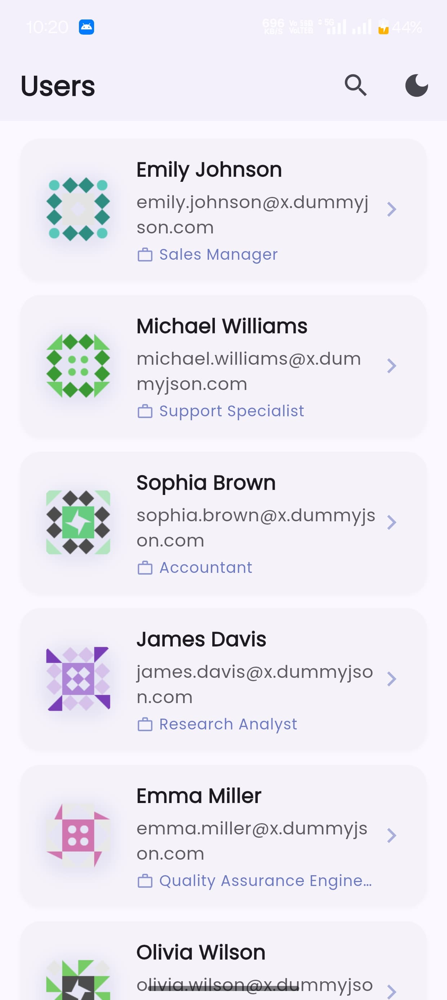
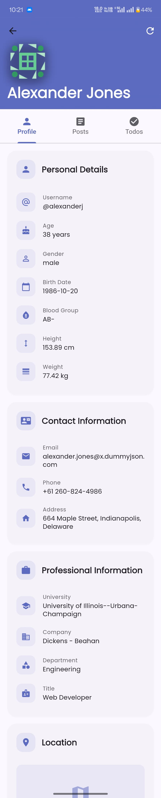
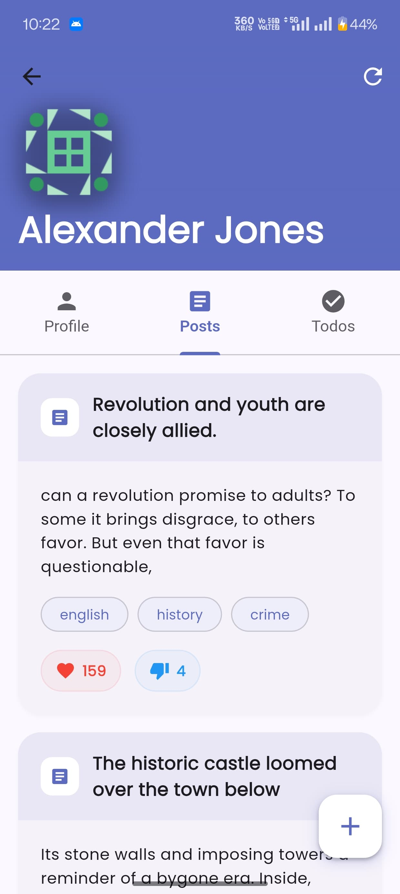
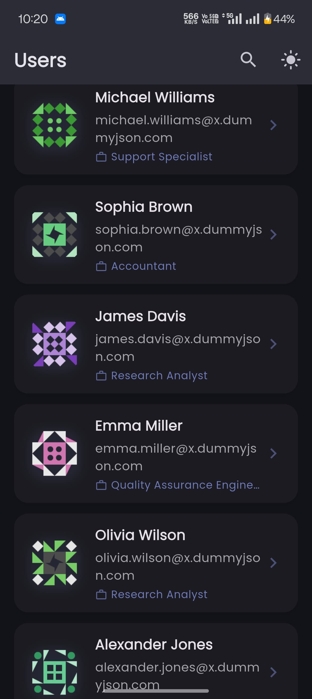
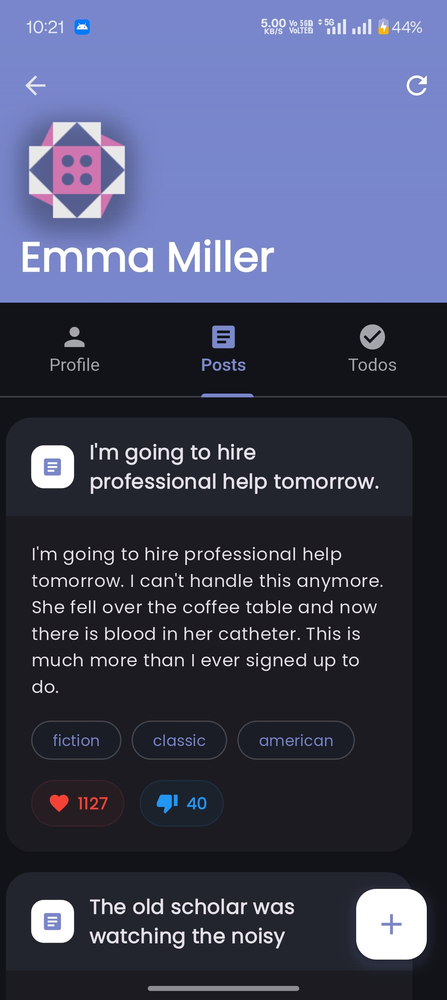

# User Management App

A Flutter application for managing user data with features for viewing, creating, updating, and deleting user information.

## Screenshots

<div align="center">
  <div style="display: flex; flex-direction: row; flex-wrap: wrap; justify-content: center; gap: 10px;">
    
    
    
    
    
    
    
  </div>
</div>

## Project Overview

This Flutter application demonstrates best practices in mobile app development, including:

- Clean architecture principles with separation of concerns
- State management using BLoC pattern
- Offline capability with local storage
- REST API integration
- Responsive UI design with support for both light and dark themes

## Setup Instructions

### Prerequisites

- Flutter SDK (^3.6.1)
- Dart SDK (^3.6.1)
- Android Studio / VS Code with Flutter extensions
- A device or emulator running Android or iOS

### Installation Steps

1. **Clone the repository**
   ```bash
   git clone <repository-url>
   cd user_management
   ```

2. **Install dependencies**
   ```bash
   flutter pub get
   ```

3. **Run the application**
   ```bash
   flutter run
   ```

4. **Build for production**
   ```bash
   flutter build apk  # For Android
   flutter build ios  # For iOS
   ```

## Architecture Explanation

The application follows a layered architecture pattern:

### 1. Presentation Layer
- **Screens**: UI components that display data to users (`screens/`)
- **BLoCs**: Business Logic Components that manage state and handle user interactions (`blocs/`)
  - Uses Flutter BLoC for predictable state management
  - Separates business logic from UI

### 2. Domain Layer
- **Models**: Data models representing entities in the application (`models/`)
- **Business Logic**: Core application logic independent of external frameworks

### 3. Data Layer
- **Services**: API communication and data processing (`services/`)
  - Handles network requests using http package
  - Provides data to the BLoCs

### 4. Infrastructure
- **Local Storage**: Persists data using Hive and SharedPreferences
- **API Integration**: RESTful API communication
- **Theme Management**: Supports both light and dark themes

## Key Features

- User CRUD operations
- Offline data persistence
- Responsive UI
- Light/Dark theme support
- Pull-to-refresh functionality

## Dependencies

The app utilizes several key packages:
- `flutter_bloc` - State management
- `http` - API communication
- `hive` & `hive_flutter` - Local data storage
- `shared_preferences` - Simple preference storage
- `google_fonts` - Custom typography
- `cached_network_image` - Image caching and loading
- `connectivity_plus` - Network connectivity detection
